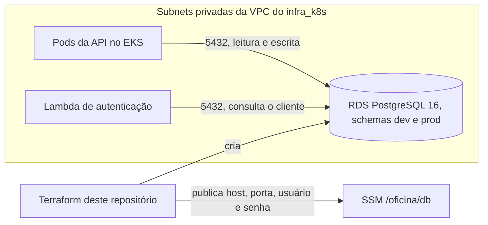
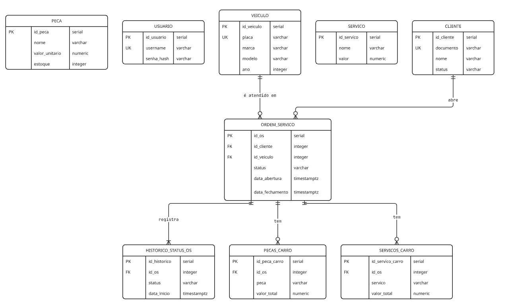

# fiap_tech_challenge_oficina_infra_database

Terraform do banco de dados da oficina: uma instância RDS PostgreSQL 16, compartilhada pelos ambientes `dev` e `prod`. Faz parte do Tech Challenge Fase 3:

| Repositório | Responsabilidade |
|---|---|
| [fiap_tech_challenge_oficina_api](https://github.com/gabrielov2003/fiap_tech_challenge_oficina_api) | Aplicação principal, no EKS |
| [fiap_tech_challenge_oficina_auth_lambda](https://github.com/gabrielov2003/fiap_tech_challenge_oficina_auth_lambda) | Autenticação por CPF e API Gateway |
| [fiap_tech_challenge_oficina_infra_k8s](https://github.com/gabrielov2003/fiap_tech_challenge_oficina_infra_k8s) | Rede, cluster EKS, segredos e Datadog |
| fiap_tech_challenge_oficina_infra_database | Este repositório. Banco de dados RDS PostgreSQL |

## Arquitetura



## Por que PostgreSQL

O domínio da oficina é relacional: toda OS depende de um cliente e de um veículo e tem itens e histórico que só existem junto com ela. O PostgreSQL garante isso no próprio banco, e o código da API usa estes recursos:

* Chaves estrangeiras e `ON DELETE CASCADE`: nenhuma OS aponta para cliente ou veículo inexistente, e apagar a OS apaga seus itens e seu histórico.
* `UNIQUE` e `CHECK`: documento, placa e usuário não se repetem, valores e estoque não ficam negativos e o status do cliente é só `ativo` ou `inativo`.
* Transações: a abertura da OS grava OS, itens e histórico juntos, e a troca de status só grava se o status lido ainda for o atual.
* `pg_advisory_xact_lock`: várias réplicas da API sobem ao mesmo tempo sem conflito na criação das tabelas.
* Função de janela `LEAD`: calcula o tempo em cada status para `GET /api/os/tempo-medio`.
* Schemas com `search_path`: `dev` e `prod` isolados no mesmo servidor.
* `NUMERIC(10, 2)` e `TIMESTAMPTZ`: dinheiro sem erro de arredondamento e datas com fuso.

O RDS entrega o banco gerenciado que o desafio pede, com backup automático, atualização de versão menor, armazenamento criptografado e acesso só pela rede privada. A classe `db.t3.micro` é elegível ao Free Tier. O SQLite da fase anterior saiu porque não aceita escrita concorrente de várias réplicas e da Lambda, e não aplicava as chaves estrangeiras.

## Modelo e relacionamentos



* Cliente e ordem de serviço, 1 para N: cada OS tem um cliente obrigatório. Cliente com OS não pode ser apagado. Para bloquear o acesso, o status muda para `inativo`.
* Veículo e ordem de serviço, 1 para N: cada OS tem um veículo obrigatório, e veículo com OS também não pode ser apagado.
* Ordem de serviço e itens, 1 para N: `pecas_carro` e `servicos_carro` formam o orçamento da OS e são apagados junto com ela.
* Ordem de serviço e `historico_status_os`, 1 para 1 ou mais: a OS nasce com uma linha em Recebida e ganha outra a cada mudança de status. O tempo em cada etapa sai da diferença entre as datas.
* Cliente e veículo não têm ligação direta. Eles se relacionam pelas OS, então o mesmo carro pode ser atendido para donos diferentes.
* `peca`, `servico` e `usuario` são independentes. Peças e serviços são o catálogo com preço de referência, e os itens da OS guardam o valor cobrado, então mudar o catálogo não altera orçamentos antigos. `usuario` guarda os funcionários, com a senha em hash.

As tabelas são criadas pela API na inicialização, em `src/infrastructure.py`.

## O que é provisionado

* Instância RDS PostgreSQL 16 `db.t3.micro`, `gp3` criptografado, com autoscaling de armazenamento até 50 GB e backup diário.
* Subnet group nas subnets privadas da VPC do `infra_k8s`, lidas do SSM.
* Security group que libera a porta 5432 só para o CIDR da VPC, onde rodam os pods e a Lambda.
* Senha gerada pelo Terraform e parâmetros de conexão no SSM.

## Parâmetros no SSM

| Parâmetro | Direção | Descrição |
|---|---|---|
| `/oficina/network/vpc_id`, `vpc_cidr` e `private_subnet_ids` | Lido | Rede criada pelo `infra_k8s` |
| `/oficina/db/host`, `port` e `name` | Publicado | Endereço, porta e nome do banco |
| `/oficina/db/username` | Publicado | Usuário administrador |
| `/oficina/db/password` | Publicado (SecureString) | Senha gerada |

## Como provisionar

O caminho normal é o pipeline em `.github/workflows/ci-cd.yml`:

| Job | Quando roda | O que faz |
|---|---|---|
| `validate` | Pull requests e pushes em `dev` e `main` | `terraform fmt` e `terraform validate` |
| `terraform` | Depois do validate | `plan` em pull requests e na `dev`, `apply` no push para `main` |

Secrets: `AWS_ACCESS_KEY_ID` e `AWS_SECRET_ACCESS_KEY`. Variáveis: `TF_STATE_BUCKET` e, opcional, `AWS_REGION`. Como o banco é compartilhado pelos dois ambientes, só a `main` aplica.

Manualmente, com Terraform 1.10+, AWS CLI configurado e o `infra_k8s` já aplicado:

```bash
terraform init -backend-config="bucket=NOME_DO_BUCKET" -backend-config="key=infra-database/terraform.tfstate" -backend-config="region=us-east-1" -backend-config="use_lockfile=true"
terraform apply
```

Variáveis principais: `region` (padrão `us-east-1`), `instance_class` (`db.t3.micro`), `multi_az` (`false`) e `max_allocated_storage` (`50`). A lista completa está em `variables.tf`.

Ordem do primeiro deploy: `infra_k8s`, este repositório, a API e por último a `auth_lambda`.

## Documentação

RFCs, ADRs, diagramas e roteiro do vídeo: [documentacao_fase3](https://github.com/gabrielov2003/TechChallenge1/tree/main/documentacao_fase3). A versão completa da justificativa do banco está em [banco_de_dados.md](https://github.com/gabrielov2003/TechChallenge1/blob/main/documentacao_fase3/banco_de_dados.md).

---
Este projeto faz parte do Tech Challenge da Pós Graduação em Arquitetura de Software da FIAP.
